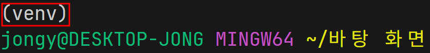
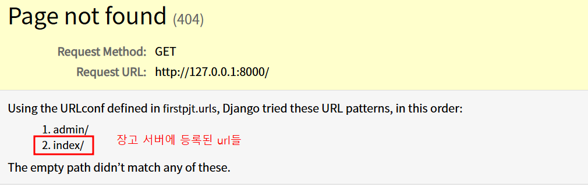

## 0. 시작하기

- 빈 폴더를 생성하고 안으로 이동한다.
- **`VSCode`** 를 실행 시켜서 시작한다.

## 1. 환경 설정

#### 가상 환경 생성

```bash
$ python -m venv venv
```

-  `pyton -m venv` : 가상 환경을 생성하는 명령어
- 보통 **<폴더명>** 을  `venv` 가 지정하는데, 그 외 이름으로 작성 가능함.

#### 가상 환경 활성화

```bash
$ source venv/Scripts/activate
```

- 가상 환경을 활성화하면 **(venv)** 가 터미널에 표시된다.
- 항상 (venv) 가 활성화 되었는지 확인한다.
 


- 참고] 가상 환경 종료
```bash
$ deactivate
```

##### 만약 git 을 사용한다면
- **`.gitignore`** 파일을 먼저 생성하고 내용을 작성한다.
-  https://www.toptal.com/developers/gitignore

#### 장고 설치

```bash
$ pip install django
```

#### requirements.txt 작성

```bash
$ pip freeze > requirements.txt
```


## 2. Django 프로젝트
#### 프로젝트 생성

```bash
$ django-admin startproject firstpjt .
```

#### 서버를 실행 후 정상 확인

```bash
$ python manage.py runserver
```

- 서버 종료하려면 터미널에서 <kbd>ctrl</kbd> + <kbd>C</kbd> 를 입력


## 3. Django 앱

#### 앱 생성

- `articles` 이름의 앱을 생성하기

```bash
$ python manage.py startapp articles
```

- 앱이 생성되면 `articles` 폴더가 생성된다.

### 앱 등록

- 프로젝트 폴더(`firstpjt`) 아래에 있는 `settings.py` 의 `INSTALLED_APPS` 변수에 앱이름 문자열을 추가

```python
# settings.py
INSTALLED_APPS = [
    
    'articles',               # <== 앱 등록

    'django.contrib.admin',
    'django.contrib.auth',

	# . . .
]
```


## 4.  url - view - template

- `http://127.0.0.1:8000/index/`

| url      | view 함수     |
| -------- | ----------- |
| `index/` | views.index |

#### url 등록

- `firstpjt/urls.py` 에 `index/` 등록

```python
# firstpjt/urls.py

from articles import views                # <==


urlpatterns = [
    path('admin/', admin.site.urls),
    path('index/', views.index),          # <==
]
```


#### view 함수 작성

- `articles/views.py` 에 `index()` 함수 작성

```python
# articles/views.py

from django.shortcuts import render
 

def index(request):
    return render(request, 'articles/index.html')
    
```

> - `render()` 함수에 대해 알아봅시다.

#### 템플릿 작성
- 앱 폴더(`articles`) 아래에 `templates` 폴더 생성
- `articles/templates` 폴더 아래에 `articles/` 폴더를 생성하고 그 아래에 `index.html` 생성

```html

<!DOCTYPE html>
<html lang="en">
	<head>	. . .
	</head>

	<body>

	  <h1>Hello, django</h1>

	</body>

</html>
```


#### 서버 실행 후 확인하기
- `http://127.0.0.1:8000/index/` 로 요청을 보내고 확인하기

-  `http://127.0.0.1:8000/`  으로 요청한 경우

