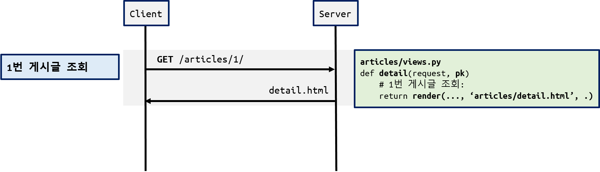
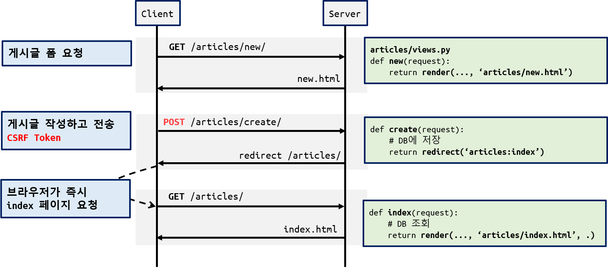
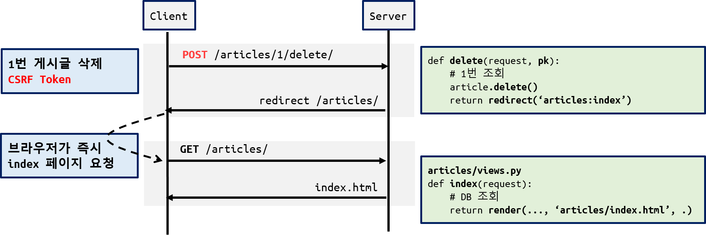
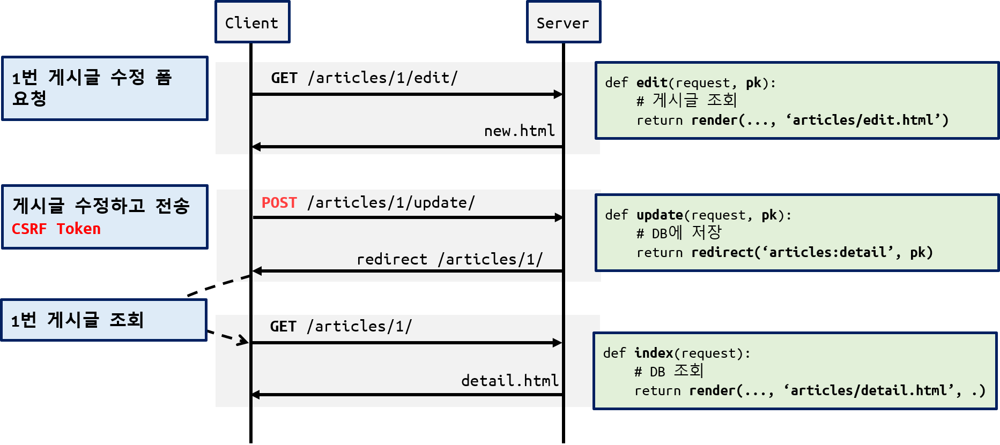

# CRUD 실습 가이드

[TOC]

---------------

## 1. 초기 환경 설정

### 가상 환경 설치 및 활성화

```bash
$ python -m venv venv

$ source venv/Scripts/activate
```

### django 설치

```bash
$ pip install django

# 패키지 설치 후 requirements.txt에 기록 
$ pip freeze > requirements.txt
```

### `crud` 프로젝트 생성

```bash
$ django-admin startproject crud .
```

### `articles` 앱 생성 및 등록

```bash
$ python manage.py startapp articles
```

- **settings.py** 의 `INSTALLED_APPS` 에 등록

```python
# crud/settings.py

INSTALLED_APPS = [
    'articles',        # <---------------

    'django.contrib.admin',
    # . . .
]
```

---------
## 2. `BASE_DIR/templates` 폴더 및 `base.html` 작성

- 왼쪽 탐색기(사이드바)에서 생성하거나 터미널에서 명령어로 생성

- `templates` 폴더에 `base.html` 파일 생성

```bash
$ mkdir templates
$ touch templates/base.html
```

- `base.html` 에 `block` 태그 추가

```html
<!DOCTYPE html>
<html lang="en">
<head></head>
<body>
  <!-- block 태그 추가 -->
  
  
</body>
</html>
```

### settings.py에 `templates` 폴더 등록하기

```python
# settings.py

TEMPLATES = [
    {
        # . . .
        'DIRS': [
            BASE_DIR / 'templates',
         ]
    },
]
```

----------
## 3. `Article` 모델 클래스 작성하기

- `Article` 클래스 정의

```python
# aritlces/models.py
from django.db import models

class Article(models.Model):
    title = models.CharField(max_length=10)
    content = models.TextField()
    created_at = models.DateTimeField(auto_now_add=True)
    updated_at = models.DateTimeField(auto_now=True)
```

### 모델 클래스 DB에 반영하기

1. 설계도 작성하기
2. DB에 반영하기

```bash
$ python manage.py makemigrations

$ python manage.py migrate
```

### Admin 계성 생성, Admin 사이트에서 레코드 생성하기

```bash
$ python manage.py createsuperuser
Username (leave blank to use 'ssafy'): admin
Email address: 
Password: 
Password (again): 
This password is too short. It must contain at least 8 characters.
This password is too common.
This password is entirely numeric.
Bypass password validation and create user anyway? [y/N]: y
Superuser created successfully
```

- 서버 실행해서 admin 사이트에 접속

#### `Article` 을 Admin 사이트에 등록하기

```python
# articles/admin.py

from django.contrib import admin
from .models import Article

admin.site.register(Article)
```

- Article 테이블에 예시 레코드를 생성

----------
## 4. `/articles/` 로 시작하는 url 처리

- 프로젝트 폴더의 `urls.py` 수정

```python
# crud/urls.py
from django.urls import path, include               # <------------

urlpatterns = [
    path('admin/', admin.site.urls),

    path('articles/', include('articles.urls')),    # <------------
]
```

- `articles` 폴더에  `urls.py` 생성

```python
# articles/urls.py
from django.urls import path
from . import views

app_name = 'articles'
urlpatterns = [

]
```

-----------------------------

### url-view-template

| 요청        |         | url                               | views 함수 | template     |
| --------- | ------- | --------------------------------- | -------- | ------------ |
| 전체 게시글 조회 |         | `articles/`                      | index    | index.html   |
| 상세 게시글 조회 |         | `articles/<int:article_pk>/`     | detail   | detail.html  |
| 게시글 작성    | Fom 요청  | `articles/new/`                  | new      | new.html     |
|           | 생성 요청   | `articles/create/`                 | create   | 없음(redirect) |
| 게시글 삭제    |         | `articles/<int:article_pk>/delete/` | delete   | 없음(redirect) |
| 게시글 수정    | Form 요청 | `articles/<int:article_pk>/edit/`   | edit     | edit.html    |
|           | 수정 요청   | `articles/<int:article_pk>/update/` | update   | 없음(redirect) |

## 5. 전체 게시글 조회

- `url` 등록

```python
# urls.py
app_name = 'articles'

urlpatterns = [
    path('', views.index, name='index'),  # <-----------------
]
```

- view 함수 작성

```python
# views.py

def index(request):
    articles = Article.objects.all()
    context = {
        'articles': articles,
    }
    return render(request, 'articles/index.html', context)
```

- index.html 

```html
# articles/templates/articles/index.html



<h1>Index</h1>


<p>글번호: {{ article.pk }}</p>
<p>글제목: {{ article.title }}</p>
<hr>

<p>아직 작성된 게시글이 없습니다.</p>



```

- 브라우저로 확인

--------

## 6. 상세 게시글 조회


- `url` 등록

```python
# urls.py
urlpatterns = [
    # ... 
    path('<int:article_pk>/', views.detail, name='detail'),  # <-----
]
```

- view 함수 작성

```python
# views.py

def detail(request, article_pk):
    article = Article.objects.get(pk=article_pk)
    context = {
        'article': article,
    }
    return render(request, 'articles/detail.html', context)
```

- `template` 작성

```html
# detail.html




<h1>게시글 상세 조회</h1>

<p>글번호: {{ article.pk }}</p>
<p>글제목: {{ article.title }}</p>
<p>글내용: {{ article.content }}</p>
<p>작성시각: {{ article.created_at }}</p>
<p>수정시각: {{ article.updated_at }}</p>
<hr>
<a href="">[Index]</a>

```

### 게시글 전체 조회 페이지에서 상세보기 링크 추가

```html
# articles/templates/articles/index.html

<p>글번호: {{ article.pk }}</p>
<p>글제목: {{ article.title }}</p>

<a href="">[상세보기]</a>

<hr>
```

-------------

## 7. 게시글 생성



- 게시글 양식 요청 `url` 등록

```python
# CRUD with Form
```

- view 함수 작성

```python
# views.py

def new(request):
	return render(request, 'articles/new.html')
```

- `template` 작성
	- `<form>`의 `action` 과 `method`  
	- `csrf_token` 
	- `<input>`의 `name` 속성

```html
# new.html
  


<h1>게시글 작성</h1>
<form action="" method="POST">
  
  <div>
    <label for="title">제목:</label>
    <input type="text" name="title" id="title">
  </div>
  <div>
    <label for="content">내용:</label>
    <textarea name="content" id="content"></textarea>
  </div>
  <input type="submit" value="작성완료">
</form>

```

- `base.html' 에 [새글 작성] 링크 걸기

```html
<!-- base.html -->
<body>
  <a href="">[새글 작성]</a>

  
  
</body>
```

----------

#### Create POST 요청 완성
- url 등록

```python
# urls.py
urlpatterns = [
    # ...  
    path('create/', views.create, name='create'), # <-----
]
```

- view 함수 작성

```python
def create(request):
    title = request.POST.get('title')
    content = request.POST.get('content')  

    article = Article(title=title, content=content)
    article.save() 

    return redirect('articles:detail', article.pk) 
```

- 게시글 생성 후 상세 조회 페이지로 `redirect`

-------

## 8. 게시글 삭제


- `url` 등록

```python
# urls.py
urlpatterns = [
    # ... 
    # 게시글 삭제 => /artices/1/delete/    
    path('<int:article_pk>/delete/', views.delete, name='delete'), # <--
]
```

- view 함수 작성성

```python
# views.py
def delete(reqeust, article_pk):
    article = Article.objects.get(pk=article_pk)
    article.delete()
    return redirect('articles:index')
```


#### 상세보기(detail.html)에 삭제 버튼(form) 추가

- `template` 작성

```html
# detail.html




<h1>게시글 상세 조회</h1>

<!-- -->
<form action="" method="POST">
  
  <input type="submit" value="삭제하기">
</form>
<!-- -->

```

--------
## 9. 게시글 수정



- `url` 등록

```python
# urls.py
urlpatterns = [
    # ... 
    # 게시글 수정폼 요청 => /artices/1/edit/    
    path('<int:article_pk>/edit/', views.edit, name='edit'),
]
```

- view 함수 작성

```python
# views.py
def edit(request, article_pk):    
    article = Article.objects.get(pk=article_pk)
    context = {
        'article': article,
    }
    return render(request, 'articles/edit.html', context)
```

- `edit.html` 작성은 `create.html`의 내용을 가져와서 수정
	- `<form>` 의 `action` 작성에 주의
	- 기존 내용을 양식에 채우기

```html
# edit.html
<h1>게시글 수정</h1>
<p>글번호: {{ article.pk }}</p>

<form action="" method="POST">
  
  
  <div>
    <label for="title">제목:</label>
    <input type="text" name="title" value="{{ article.title }}">
  </div>

  <div>
    <label for="content">내용:</label>
    <textarea name="content" id="content">{{ article.content }}</textarea>
  </div>

  <input type="submit" value="수정하기">
</form>

<a href="">[BACK]</a>
```

- 게시글 상세 보기(detail.html)에 **[수정 하기]** 링크 추가

```html
# detail.html


<h1>게시글 상세 조회</h1>

<!-- 수정하기 링크 추가 -->
<a href="">[수정하기]</a>

<form action="" method="POST">
  
  <input type="submit" value="삭제하기">
</form>
<!-- -->

```

-----

### 수정하기 POST 요청 완성

- `url` 등록

```python
# urls.py
urlpatterns = [
    # ...     
    path('<int:article_pk>/update/', views.update, name='update'),
]
```


- `update` 함수 작성

```python
def update(request, article_pk):    
    article = Article.objects.get(pk=article_pk)
    
    article.title = request.POST.get('title')
    article.content = request.POST.get('content')
  
    article.save()

    return redirect('articles:detail', article.pk)
```


