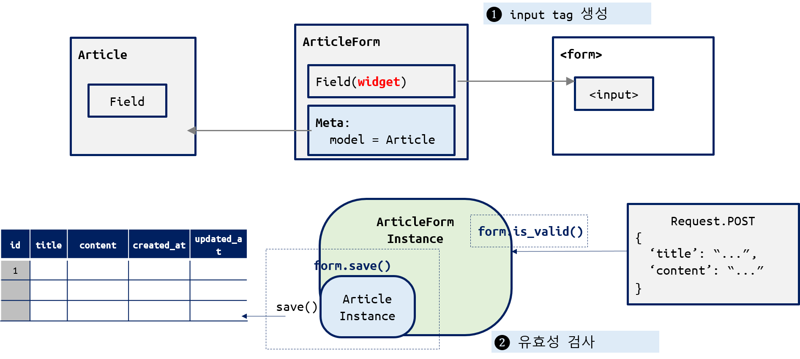
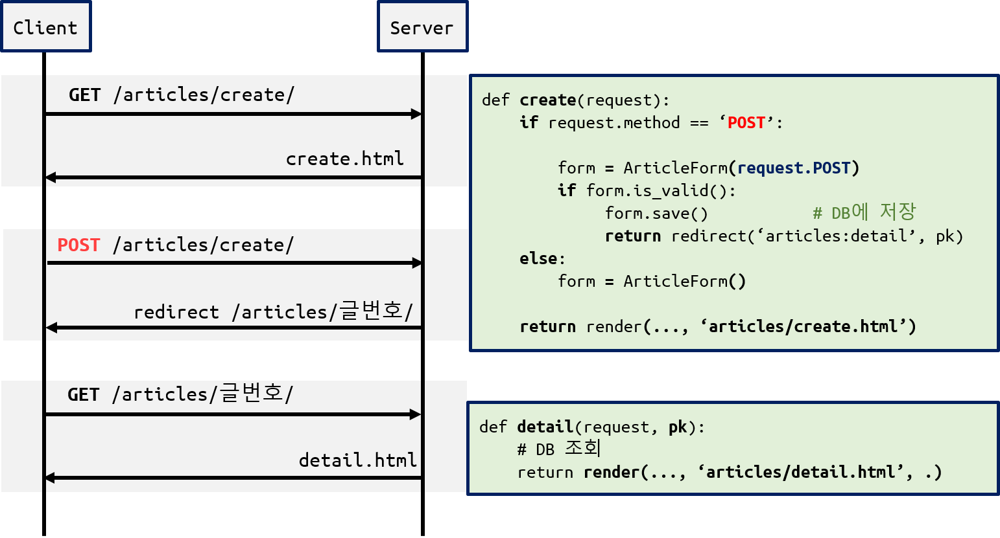
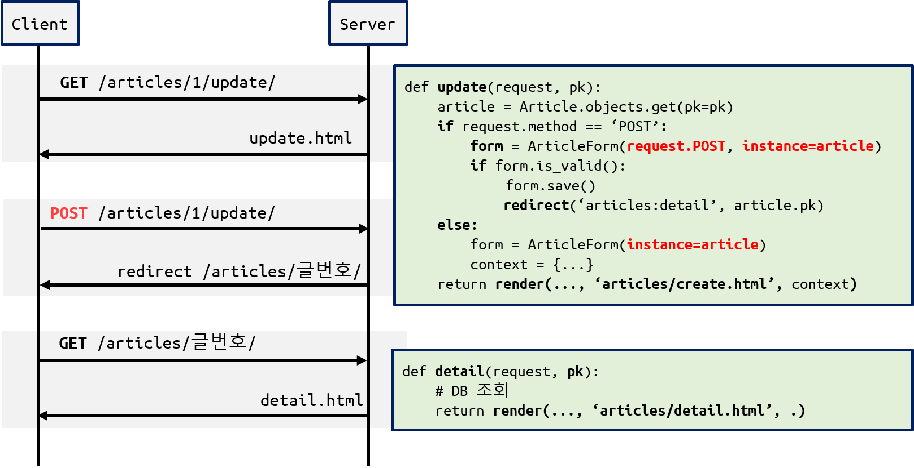

# CRUD with Form

[TOC]


<div style="page-break-after: always;"></div>


## 1. Model Form

- 모델 필드로 부터 `<input>` 태그 생성
- 모델 필드에 해당하는 데이터의 유효성 검증



#### ArticleForm 정의

- `forms.py` 파일을 생성하고 작성

```python
class ArticleForm(forms.ModelForm):

    class Meta:
        model = Article
        fields = '__all__'
```

<div style="page-break-after: always;"></div>


## 2. URL/Views/Template 변경 사항

- 게시글 작성과 수정은 각각 2개의 `url` 과 `view 함수` 가 필요했지만, **HTTP method** 로 요청을 구분하면 `url` 을 하나로 줄이고, 하나의 `view 함수`에서 처리할 수 있다.

| 요청         | method      | url                                 | views 함수 | template     |
| ---------- | ----------- | ----------------------------------- | -------- | ------------ |
| 전체 게시글 조회  |             | `articles/`                         | index    | index.html   |
| 상세 게시글 조회  |             | `articles/<int:article_pk>/`        | detail   | detail.html  |
| **게시글 작성** | **GET 요청**  | `articles/create/`                  | create   | create.html  |
|            | **POST 요청** | 상동                                  | create   | 없음(redirect) |
| 게시글 삭제     |             | `articles/<int:article_pk>/delete/` | delete   | 없음(redirect) |
| **게시글 수정** | **GET 요청**  | `articles/<int:article_pk>/update/` | update   | update.html  |
|            | **POST 요청** | 상동                                  | update   | 없음(redirect) |

<div style="page-break-after: always;"></div>


## 3. 게시글 작성



#### url 수정

```python
# urls.py
urlpatterns = [
    # ... 

    # 작성 양식 요청 URL 삭제
    # path('new/', views.new, name='new'), # <-----

    # 게시글 생성 요청 articles/create/
    path('create/', views.create, name='create'),
    
    # ...
]
```

#### `base.html`의 새글 작성 링크 수정

```html
<!--
<a href="">[새글 작성]</a>
-->

<a href="">[새글 작성]</a>
```

#### create() 함수 - GET 요청 처리

```python
def create(request):

    if request.method == 'POST':
        pass

    else:
        form = ArticleForm()

    context = {
        'form': form,
    }
    return render(request, 'articles/create.html', context)
```

#### create.html 작성

```html
<form action="" method="POST">
  

  {{ form.as_p }}
  <input type="submit" value="제출">
</form>
```

#### create() 함수 - POST 요청 처리

```python
def create(request):

    if request.method == 'POST':
        form = ArticleForm(request.POST)
        
        if form.is_valid():
            article = form.save()
            return redirect('articles:detail', article.pk)
    else:
        form = ArticleForm()

    context = {
        'form': form,
    }
    return render(request, 'articles/create.html', context)
```

<div style="page-break-after: always;"></div>

 

## 4. 게시글 수정



#### url 수정

```python
# urls.py
urlpatterns = [
    # ... 

    # 수정 양식 요청 URL 삭제
    # path('<int:pk>/edit/', views.edit, name='edit'),

    # 실제 레코드 수정 요청 articles/1/update/
    path('<int:pk>/update/', views.update, name='update'),
    
    # ...
]
```

#### detail.html의 수정 링크 변경하기

```html
<!--
<a href="">[EDIT]</a>
 -->

<a href="">[EDIT]</a>
```

#### update() 함수 - GET 요청 처리

```python
def create(request):

    if request.method == 'POST':
        pass

    else:
        form = ArticleForm()

    context = {
        'form': form,
        'article': article,  # <--------- 주의!!!!!
    }
    return render(request, 'articles/create.html', context)
```

#### update.html 작성

```html
<form action="" method="POST">
  
  
  {{ form.as_p }} 

  <input type="submit" value="제출">
</form>
```

#### update() 함수 - POST 요청 처리

```python
def update(request, pk):

    article = Article.objects.get(pk=pk)

    if request.method == 'POST':
        form = ArticleForm(request.POST, instance=article)
        if form.is_valid():
            form.save()
            return redirect('articles:detail', article.pk)

    else:
        form = ArticleForm(instance=article)

    context = {
        'form': form,
        'article': article,
    }
    return render(request, 'articles/update.html', context)
```
