# REST API

[toc]

## 1. 프로젝트 생성 및 설정

### Postman 설치하기

    [다운로드](https://www.postman.com/downloads/)

### 프로젝트 및 앱 생성하기

- 가상 환경 설치 및 활성화

```bash
$ python -m venv venv

$ source venv/Scripts/activate
```

- `django`, `drf`, `django-seed`,  설치
- `django-seed` 를 사용하려면 `psycopg2` 가 필요함.
- `django 5.xxx 버전과 호환되지 않음.`

```bash
$ pip install django==4.2.10 djangorestframework django-seed psycopg2
```

- `my_api` 프로젝트 생성

```bash
$ django-admin startproject my_api .
```

- `articles` 앱 생성

```bash
$ python manage.py startapp articles
```

- `settings.py`에 `articles`, `rest_framework`, `django_seed` 등록하기

```python
# my_api/settings.py

INSTALLED_APPS = [
    'articles',
    'rest_framework',  
    'django_seed',    
    # . . .
]
```

## 2. `article` 모델 작성 및 URL 정리

- `Article` 모델 작성

```python
# articles/models.py
from django.db import models

class Article(models.Model):
    title = models.CharField(max_length=10)
    content = models.TextField()
    created_at = models.DateTimeField(auto_now_add=True)
    updated_at = models.DateTimeField(auto_now=True)
```

- `URL` 분리 하기

```python
# my_api/urls.py

from django.urls import path, include

urlpatterns = [
    # . . .
    path('api/v1/', include('articles.urls')),
]
```

- `articles` 폴더에 `urls.py` 생성

```python
# articles/urls.py

from django.urls import path
from . import views

urlpatterns = [

]
```

- 템플릿을 사용하지 않으므로 `app_name` 과 URL 등록시에 name 도 설정 하지 않음.

#### DB에 적용하기

```bash
$ python manage.py makemigrations

$ python manage.py migrate
```

### 2.1 샘플 레코드 생성하기

#### 방법1> Fixtures 파일에서 읽어오기

- `article.json` 파일에서 읽어오기

```bash
$ python manage.py loaddata article.json
```

#### 방법2> django-seed로 생성하기

- `articles` 앱에 작성된 `Article` 의 레코드 10개 생성

```bash
$ python manage.py seed --number 10 articles
```

## 3. Article(single model) CRUD

### URL과 Request

|                       | **GET** | **POST**                          | **PUT** | **DELETE**                            |
| --------------------- | ------------- | --------------------------------------- | ------------- | ------------------------------------------- |
| **articles/**   | 전체글 조회   | 글 작성``응답코드: **201** |               |                                             |
| **articles/1/** | 1번 글 조회   |                                         | 1번 글 수정   | 1번 글 삭제``응답코드: **204** |

- 유효성 검증이 실패하면 **400** 응답코드를 반환한다.

---

### 3.1 게시글 전체 조회

#### 게시글 전체 조회를 위한 serializer 작성

- `articles` 폴더 아래에 `serializers.py` 파일 생성

```python
# articles/serializers.py

from rest_framework import serializers
from .models import Article

class ArticleListSerializer(serializers.ModelSerializer):

    class Meta:
        model = Article
        fields = ('id', 'title',)
```

#### 게시글 전체 조회 URL

```python
# articles/urls.py


urlpatterns = [
    # 전체글 조회(GET) 및 새 게시글 작성(POS)
    path('articles/', views.article_list),

]
```

#### 게시글 전체 조회 View 함수

- 필요 모듈등을 import 하기

```python
from rest_framework.decorators import api_view
from rest_framework.response import Response
from rest_framework import status

from .models import Article
from .serializers import ArticleListSerializer
```

- `article_list` 함수 작성
- 전체 게시글을 직렬화하는 경우에 **`many=True`** 작성에 주의
- `GET` 요청에 대한 정상적인 응답 코드는 `200`

```python
@api_view(['GET',])
def article_list(request):
    articles = Article.objects.all()  
    serializer = ArticleListSerializer(articles, many=True) # many=True 주의!!!!!

    return Response(serializer.data) 
```

- 서버 실행

```bash
$ python manage.py runserver
```

- 크롬 브라우저로 확인하기
  - `http://127.0.0.1:8000/api/v1/articles/`

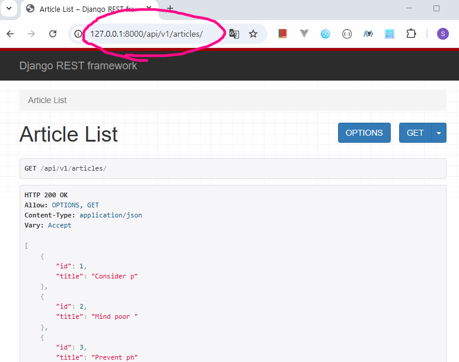

- Postman으로 확인하기

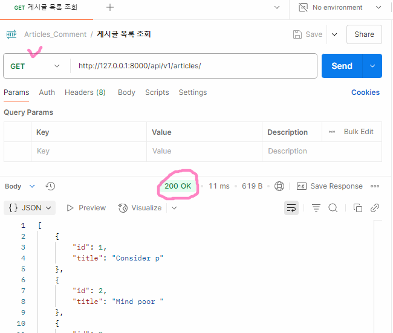

---

### 3.2 게시글 상세 조회

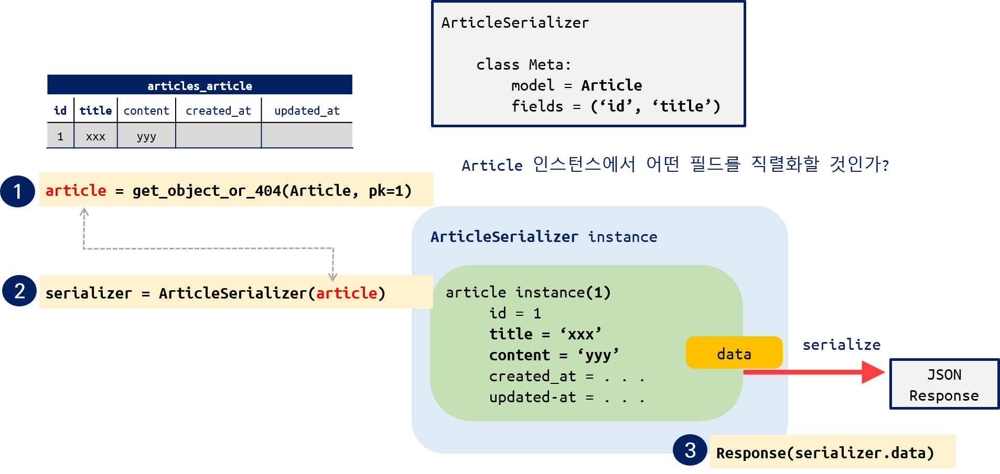

#### 게시글 상세 조회를 위한 serializer 작성

- `ArticleSerializer` 정의

```python
# articles/serializers.py

# . . .

class ArticleSerializer(serializers.ModelSerializer):
    class Meta:
        model = Article
        fields = '__all__'
```

#### 게시글 상세 조회 URL

- 상세 조회 URL을 수정, 삭제에도 사용할 예정

```python
# articles/urls.py

urlpatterns = [
    # . . .
    # 글 상세 조회(GET), 수정(PUT), 삭제(DELETE)
    path('articles/<int:article_pk>/', views.article_detail),
]
```

#### 게시글 상세 조회 View 함수

- `article_detail` 함수 작성

```python
# ArticleSerializer import
from .serializers import ArticleListSerializer, ArticleSerializer

@api_view(['GET',])
def article_detail(request, article_pk):
    article = Article.objects.get(pk=article_pk)
    serializer = ArticleSerializer(article)

    return Response(serializer.data)
```

- Postman으로 확인하기

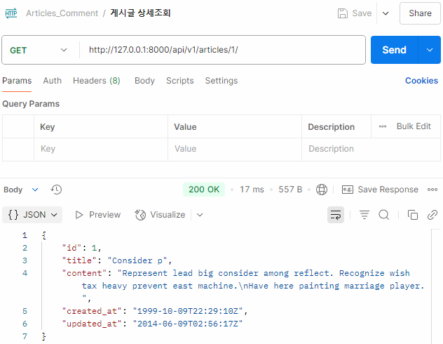

---

### 3.3 게시글 작성하기

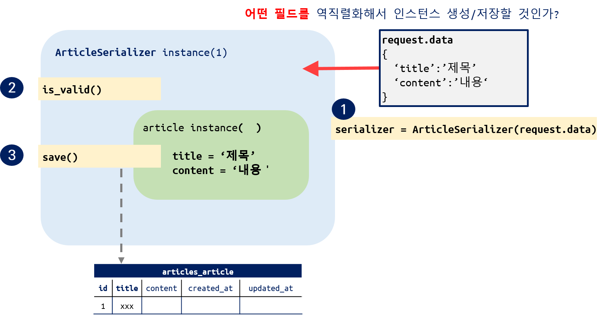

- `article_list` 함수에서 GET/POST를 구분해서 작성

```python
@api_view(['GET', 'POST', ])        # <--- POST 추가
def article_list(request):

    if request.method == 'GET':
        articles = Article.objects.all()  
        serializer = ArticleListSerializer(articles, many=True)
        return Response(serializer.data)

    # ---------------- 게시글 작성 ----------------
    elif request.method == 'POST':      
        serializer = ArticleSerializer(data=request.data)

        if serializer.is_valid(raise_exception=True):
            serializer.save()
            return Response(serializer.data, status=status.HTTP_201_CREATED)
```

- Postman으로 확인

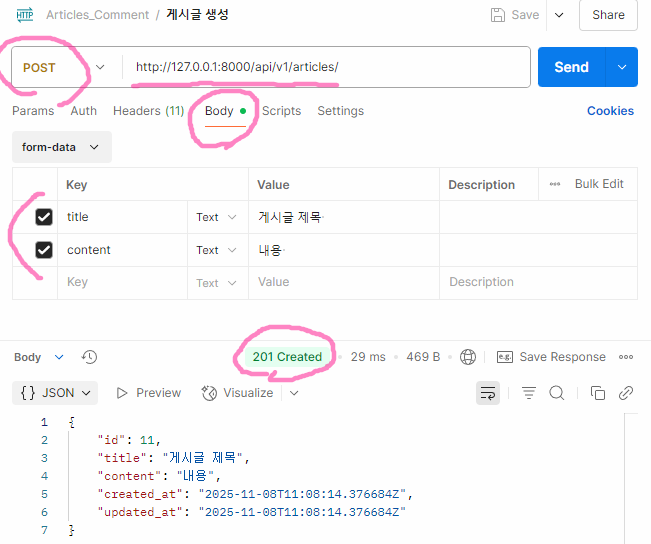

### 3.4 게시글 수정 및 삭제하기

- `article_detail` 함수 완성하기

```python
@api_view(['GET', 'PUT', 'DELETE',])            # <------ PUT, DELETE
def article_detail(request, article_pk):
    article = Article.objects.get(pk=article_pk)

    if request.method == 'GET':
        serializer = ArticleSerializer(article)
        return Response(serializer.data)

    elif request.method == 'PUT':
        serializer = ArticleSerializer(article, request.POST, partial=True)
                                                            # partial 매개변수 확인
        if serializer.is_valid(raise_exception=True):
            serializer.save()
            return Response(serializer.data)

    elif request.method == 'DELETE':
        article.delete()
        return Response(
            {'delete': f'{article_pk}번 삭제'},
            status=status.HTTP_204_NO_CONTENT
        )
```

- 게시글 수정

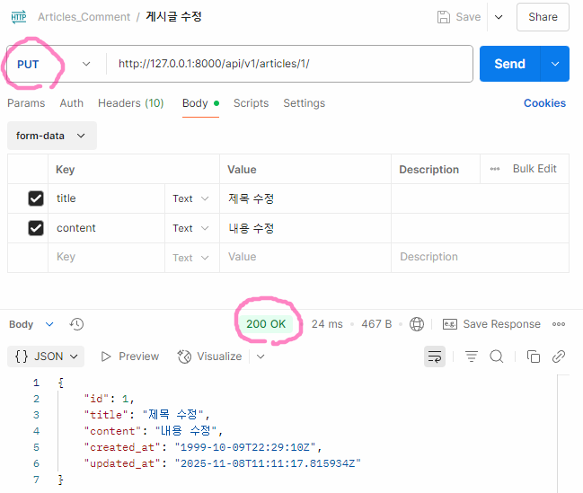

- 게시글 삭제

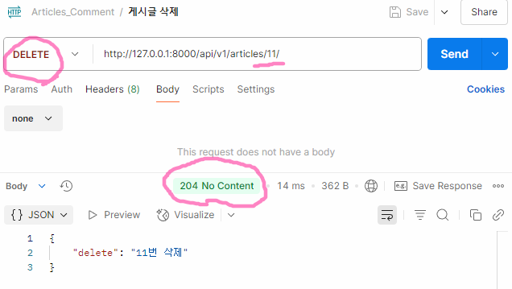

---

## 4. 1:N Relation

### 4.1 Comment 모델 작성

```python
# articles/models.py

class Comment(models.Model):          
    article = models.ForeignKey(Article, on_delete=models.CASCADE)
    content = models.TextField()
    created_at = models.DateTimeField(auto_now_add=True)
    updated_at = models.DateTimeField(auto_now=True)

```

- 기존의 db 파일 삭제하고 Migration 진행

```bash
$ python manage.py makemigrations

$ python manage.py migrate
```

- Fixtuers 로드

```bash
$ python manage.py loaddata articles.json comments.json
```

- `django-seed` 로 생성

```bash
$ python manage.py seed --number 10 articles
```

### URL and Request

|                                | GET            | POST                   | PUT           | DELETE        |
| ------------------------------ | -------------- | ---------------------- | ------------- | ------------- |
| **comments/**            | 댓글 목록 조회 |                        |               |               |
| **comments/1/**          | 1번 댓글 조회  |                        | 1번 댓글 수정 | 1번 댓글 삭제 |
| **articles/1/comments/** |                | 1번 게시글의 댓글 생성 |               |               |

### 4.2 댓글 목록 조회

- `CommentSerializer` 정의

```python
# articles/serializers.py

from .models import Article, Comment   # <---- Comment 추가

class CommentSerializer(serializers.ModelSerializer):
    class Meta:
        model = Comment
        fields = '__all__'
```

- 전체 댓글 조회 URL 작성

```python
# articles/urls.py

urlpatterns = [
    # ....

    # 전체 댓글 조회(GET)
    path('comments/', views.comment_list),
]
```

- `comment_list` 함수

```python
from .models import Comment                  # <--- 추가
from .serializers import CommentSerializer   # <--- 추가

@api_view(['GET', ])
def comment_list(request):
    comments = Comment.objects.all()
    serializer = CommentSerializer(comments, many=True)
    return Response(serializer.data)
```

- Postman으로 확인

---

### 4.3 단일 댓글 조회

- `URL` 작성 -> 수정/삭제에도 사용

```python
urlpatterns = [
    # . . .

    # 단일 댓글 조회(GET), 수정(PUT), 삭제(DELETE)
    path('comments/<int:comment_pk>/', views.comment_detail),
]
```

- `comment_detail` 함수 작성

```python
@api_view(['GET', ])
def comment_detail(request, comment_pk):
    comment = Comment.objects.get(pk=comment_pk)
    serializer = CommentSerializer(comment)
    return Response(serializer.data)

```

---

### 4.4 댓글 생성

- `URL` 등록 -> Comment 테이블에 저장하려면 연관된 Article에 대한 정보가 필요

```python
urlpatterns = [  
    # . . .

    # 댓글 생성 => ForeignKey에 해당하는 article 에 대한 정보가 필요
    path('articles/<int:article_pk>/comments/', views.comment_create),
]
```

- `Comment.article` 을 **유효성 검증에서 제외**시키기

```python
class CommentSerializer(serializers.ModelSerializer):

    class Meta:
        model = Comment
        fields = '__all__'
        read_only_fields = ('article', )  # <---- 주의

```

- `comment_create` 함수 작성

```python
@api_view(['POST', ])
def comment_create(request, article_pk):

    article = Article.objects.get(pk=article_pk)
    serializer = CommentSerializer(data=request.data)

    if serializer.is_valid(raise_exception=True):
        # article 인스턴스 추가 설정
        serializer.save(article=article)
        return Response(serializer.data, status=status.HTTP_201_CREATED)

```

- Postman으로 확인

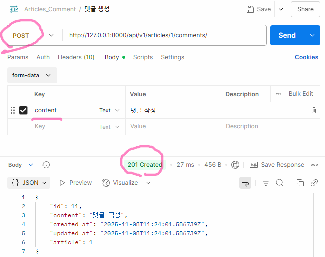

---

### 4.5 댓글 삭제, 수정

- `comment_detail` 함수 수정

```python
@api_view(['GET', 'PUT', 'DELETE', ])
def comment_detail(request, comment_pk):

    comment = Comment.objects.get(pk=comment_pk)

    if request.method == 'GET':
        serializer = CommentSerializer(comment)
        return Response(serializer.data)

    elif request.method == 'PUT':
        serializer = CommentSerializer(comment, request.data, partial=True)
        if serializer.is_valid(raise_exception=True):
            serializer.save()
            return Response(serializer.data)

    elif request.method == 'DELETE':
        comment.delete()
        msg = {'delete': f'댓글 {comment_pk}번 삭제'},
        return Response(msg, status=status.HTTP_204_NO_CONTENT)
```

---

### 4.6 댓글 조회 시 article 정보를 추가하기 (참조)

- `CommentSerializer` 수정
  - 내부 클래스 정의해서 게시글 제목 출력하기

```python

class CommentSerializer(serializers.ModelSerializer):

    class ArticleTitleSerializer(serializers.ModelSerializer):
        class Meta:
            model = Article
            fields = ('title', )
  
    article = ArticleTitleSerializer(read_only=True)

    class Meta:
        model = Comment
        fields = '__all__'      
```

- Postman으로 확인하기

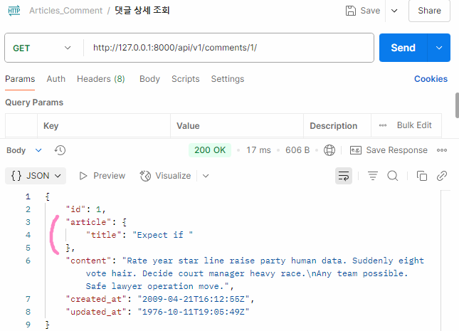

---

### 4.7 게시글 조회 시 댓글 목록 추가하기 (역참조)

- `ArticleSerializer` 수정

```python
class ArticleSerializer(serializers.ModelSerializer):

    class CommentDetailSerializer(serializers.ModelSerializer):  
        class Meta:
            model = Comment
            fields = ('id', 'content',)
          
    comment_set = CommentDetailSerializer(read_only=True, many=True)

    class Meta:
        model = Article
        fields = '__all__'
```

- Postman으로 확인

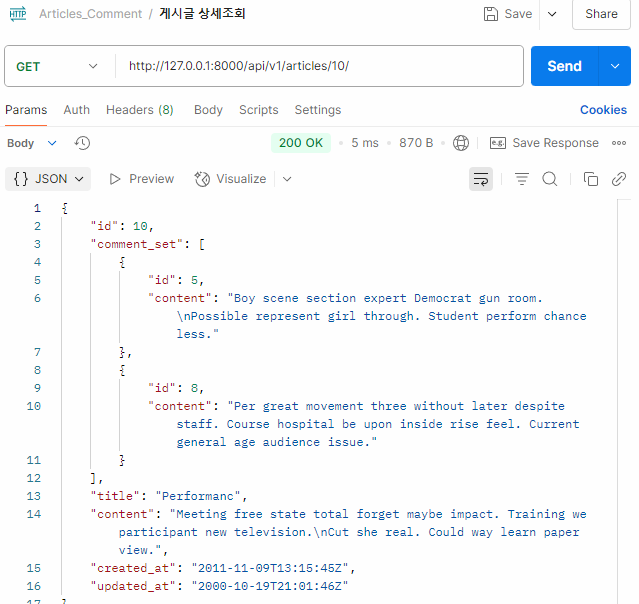

### 4.8 댓글 개수 추가

- `ArticleSerializer` 에 추가 하기

```python

 comment_count = serializers.IntegerField(
             source='comment_set.count', read_only=True)
```
